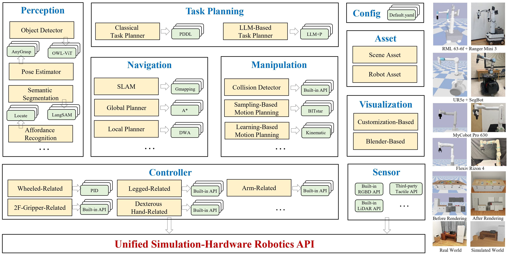

<br>
<p align="center">
<h1 align="center"><strong>BestMan: A Modular Mobile Manipulator Platform for Embodied AI with Unified Simulation-Hardware APIs</strong></h1>
  <p align="center">
    Chongqing University&emsp;&emsp;&emsp;&emsp;Shanghai AI Laboratory&emsp;&emsp;&emsp;&emsp;Xi'an Jiaotong-Liverpool University
  </p>
</p>

<div id="top" align="center">


<!-- # BestMan - A Pybullet-based Mobile Manipulator Simulator -->

[](http://arxiv.org/abs/2410.13407)
[](https://arxiv.org/pdf/2410.13407)
[](https://github.com/facebookresearch/home-robot/blob/main/LICENSE)
[](https://github.com/pre-commit/pre-commit)
[](https://github.com/psf/black)
[](https://timothycrosley.github.io/isort/)
[](https://bestman-pybullet.readthedocs.io)


Welcome to the official repository of BestMan!

A mobile manipulator (with a wheel-base and arm) platform built on PyBullet simulation with unified hardware APIs.

</div>

## 📋 Contents

- [🔥 News](#-news)
- [🎯 Framework](#-Framework)
- [🏠 Getting Started](#-getting-started)
  - [Prerequisites](#prerequisites)
  - [Installation](#installation)
- [👨‍💻 Basic Demos](#-basic-demos)
  - [🌏 Overview](#-overview)
  - [🚀 Run](#-run)
  - [🎇 Blender Render](#-blender-render)
- [📝 TODO List](#-todo-list)
- [🤝 Reference](#-reference)
- [👏 Acknowledgements](#-acknowledgements)
- [🚀 Working citing BestMan](#-working-citing-bestman)

## 🔥 News
- [2024-11] We released version 0.2.0, optimizing modules such as Install and Robotics API.
- [2024-10] We release the [paper](http://arxiv.org/abs/2410.13407) of BestMan.

## 🎯 Framework



## 🏠 Getting Started

### Prerequisites

> ***Note**: We recommand Ubuntu 22.04 and python version deault to 3.8.*

- Ubuntu 20.04, 22.04
- Conda 
  - Python 3.8, 3.9, 3.10

### Installation

We provide the installation guide [here](Install/install.md). You can install locally or use docker and verify the installation easily.

## 👨‍💻 Basic Demos

### 🌏 Overview

<video src="https://github.com/user-attachments/assets/499aed7a-6756-4bf5-b25b-84ad1b23d6f9"></video>

### 🚀 Run

Enter `Examples` directory and run the demos. You can also modify the parameters corresponding to the demo.

### 🎇 Blender Render

`open microwave` demo in **Overview** before blender rendering:

<video src="https://github.com/user-attachments/assets/fb8ef3ea-d045-4bbf-a28f-0bec56930aae"></video>

<br/>

We have improved the [pybullet-blender-recorder](https://github.com/huy-ha/pybullet-blender-recorder) to import pybullet scene into blender for better rendering

If you want to enable **pybullet-blender-recorder**, please：

1. Install the `pyBulletSimImporter.py` plugin under **Visualization/blender-render** directory in blender (Edit->Preferences->Add-ons->Install) (test on **blender3.6.5**) , and enalbe this plugin.


  
2. Set `blender: Ture` in **Config/xxx.yaml**.

3. After running the demo, a pkl file will be generated and saved in **Examples/record** dir

4. Import the pkl files into blender.

> Note: This will freeze the current blender window before the processing is completed, please wait.


<br/>
<br/>

> Note: If the demo contains too many frames, you can change `pyBulletSimImporter.py`: ANIM_OT_import_pybullet_sim(): **skip_frames** parameters and reinstall in blender to reduce the number of imported frames.
<br/>

## 📝 TODO List

- \[x\] Release the platform with basic modules、functions and demos.
- \[x\] Polish APIs, related codes, and release documentation.
- \[x\] Release the paper with framework and demos Introduction.
- \[ \] Release the baseline models and benchmark modules.
- \[ \] Dynamically integrate digital assets.
- \[ \] Comprehensive improvement and further updates.


## 🤝 Reference

If you find this work useful, please consider citing:

```
@inproceedings{Yang2024BestManAM,
  title={BestMan: A Modular Mobile Manipulator Platform for Embodied AI with Unified Simulation-Hardware APIs},
  author={Kui Yang and Nieqing Cao and Yan Ding and Chao Chen},
  year={2024},
  url={https://api.semanticscholar.org/CorpusID:273403368}
}
```

## 👏 Acknowledgements

We would like to express our sincere gratitude to all the individuals and organizations who contributed to this project.

For a detailed list of acknowledgements, please refer to [appendix](docs/appendix).

## 🚀 Working citing BestMan

Research has already been conducted based on the BestMan platform. If you are interested, please visit [here](https://bestmanrobot.com/Works_Citing_BestMan) for more details.
